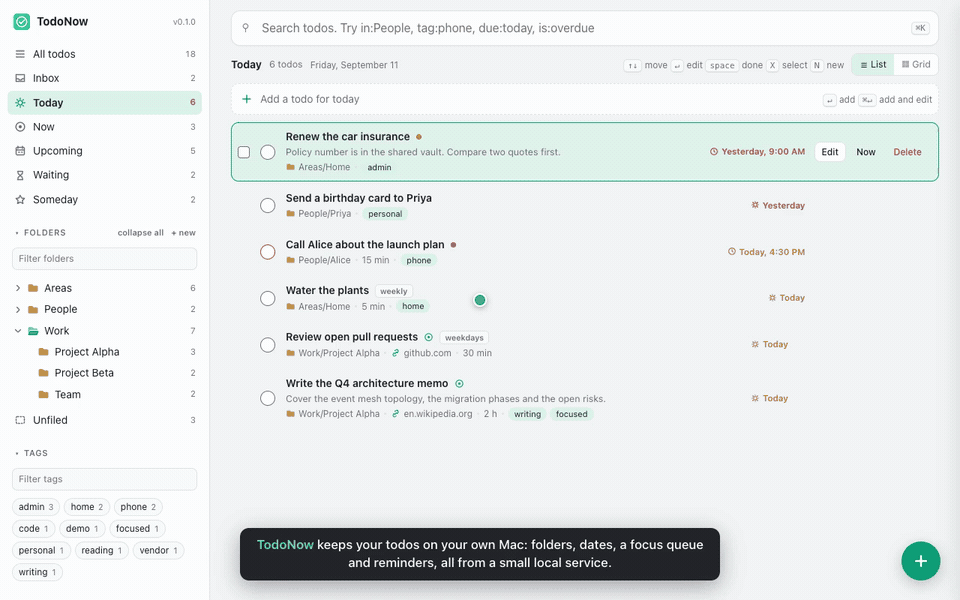

# TodoNow

A personal todo tracker for macOS that stays on your machine. Nested folders
for people, areas and projects, a Today view that gathers what is due, planned
or overdue, a short Now queue for your current focus, and macOS notifications
for deadlines and a daily summary.

No app is installed, nothing is compiled and nothing sits in your menu bar: a
small Node service runs as a login agent and the UI is a local web page. Your
data is plain JSON in this folder.

TodoNow is the sibling of [Golinks](https://github.com/gvensan/golinks): the
same local-service model, the same web UI shell and the same visual system, so
the two look and behave alike.

## Walkthrough



Under two minutes with captions: quick capture, completing with Undo, search
operators, the Now, Upcoming and Waiting views, the folder tree, dragging a row
into a folder, selecting several todos, the edit drawer, the setup checklist
and import/export. A sharper MP4 of the same walkthrough is at
[docs/demo.mp4](docs/demo.mp4). The recording uses a demo data set, not real
todos.

## What you get

- **Views.** Inbox, Today, Now, Upcoming, Waiting, Someday, Unfiled, All,
  Completed and Trash, plus any folder or tag. List or grid, keyboard driven.
- **One home per todo.** Nested folders such as `People/Alice`, `Areas/Home` or
  `Work/Project Alpha`. A folder view includes its subfolders. Drag a todo onto
  a folder, drag folders into each other, rename or delete with the contents
  following. Tags remain optional cross-cutting labels.
- **Dates that mean something.** A deadline (with a time) and a planned day are
  separate. Today shows what is due or planned today, anything overdue and
  planned days that slipped; Upcoming shows later deadlines. Recurring todos
  file their next occurrence when you complete them.
- **Now.** A short, deliberate queue for your current focus, with the estimated
  time added up.
- **Reminders.** A daily macOS notification at a configurable time and a
  notification before each deadline (one hour by default, per-todo override,
  snooze, quiet hours). Notifications carry the TodoNow name and icon. The
  ledger survives restarts so nothing fires twice.
- **Search that understands todos.** `in:People/Alice`, `tag:phone`,
  `due:today`, `due:week`, `planned:today`, `is:overdue`, `is:now`,
  `is:unfiled`, `is:recurring`, `priority:high`, plus plain words over title,
  notes, link, folder and tags, with matches highlighted.
- **Select several at once.** Hover a row for its checkbox, Shift+click for a
  range, or press X, then complete, move, add to Now or delete them together,
  with Undo.
- **Save any web page as a todo.** The "TodoNow" bookmarklet opens a small
  popup with the page title, selected text as notes, folder, dates and tags;
  the page stays attached to the todo as a link.
- **Trash.** Deleted todos wait 30 days (configurable) and can be restored;
  the toast after a delete offers Undo.
- **Import and export.** One JSON file with every todo, folder and setting.
  Imports are validated record by record.
- **Setup checklist and doctor.** A page in the UI walks through the one-time
  steps; `bin/todonow doctor` does the same from Terminal.
- **Local only.** The service listens on 127.0.0.1, refuses other hosts and
  cross-site writes, and your data is plain files in this folder.

## Install

Requirements: macOS and Node 18 or newer. No Git, no Homebrew and no developer
tools are needed.

### Step 1: install Node.js (once)

If you do not know whether you have it, you probably do not. Go to
[nodejs.org](https://nodejs.org), click **Download Node.js (LTS)**, open the
downloaded `.pkg` and click through the installer. Developers who already use
nvm, Volta or Homebrew can skip this; the installer finds those too.

### Step 2: install TodoNow

On the [GitHub page](https://github.com/gvensan/todonow) click the green
**Code** button, then **Download ZIP**. Double-click the zip in Downloads to
unpack it, drag the `todonow-master` folder into your home folder and rename it
`todonow`. Then, in Terminal (Cmd+Space, type `Terminal`, press Return):

```
cd ~/todonow
bash install.sh
```

Tip: type `cd ` in Terminal and drag the folder onto the Terminal window to fill
in the path. Keep the folder where the install ran; the service runs from it and
your todos are stored in it.

**Developers**:

```
git clone git@github.com:gvensan/todonow.git ~/todonow
cd ~/todonow && ./install.sh
```

The install links `bin/node`, links `~/.todonow` to the folder, builds the small
notification app, loads the launchd agent `dev.todonow` and opens the setup
checklist at http://127.0.0.1:7778/#/settings/setup. Only the agent plist lives
outside the folder.

### Step 3: the setup checklist

The install opens **Settings > Setup checklist**. The same page opens on its
own the first time you visit the UI with no todos. Each step has a **Mark
done** button; the service step checks itself.

1. **TodoNow starts when you log in** (checked automatically).
2. **Allow notifications.** Send a test notification, then allow TodoNow under
   System Settings > Notifications; a button opens that pane. macOS files a new
   background sender as off until you flip the switch once.
3. **Save any web page as a todo.** Show the bookmarks bar (Cmd+Shift+B) and
   drag the "TodoNow" button onto it. If dragging does not work, Copy code and
   paste it into a new bookmark by hand; the page explains how.
4. **Add todos from the Terminal** (optional): `bin/todonow add "Call Alice"`.
5. **Bring in an export** (optional). Opens Settings > Import and export.

## Daily use

| Want to | Do |
| --- | --- |
| Capture a todo | Type in the line at the top of any view and press Return; `A` focuses it, `N` opens the full form |
| Save the page you are on | Click the "TodoNow" bookmarklet |
| Plan the day | Today: what is due, planned or overdue. Pull a few into Now with the row button |
| Park something | Status Waiting (with who you wait for) or Someday |
| Finish | Click the circle or press `space`; Undo is in the toast |
| Find something | `⌘K` or `/`, then words or operators like `in:Work due:week` |
| Do several at once | `X`, Shift+click or `⌘A`, then Complete, Move, Add to Now or Delete |
| Back up or move your todos | Settings > Import and export |
| Save from a script | `bin/todonow add "title" [folder]` or `curl -X POST localhost:7778/api/todos -H 'content-type: application/json' -d '{"title":"..."}'` |

Web UI keys: arrows move, `Enter` or `E` edits, `space` completes, `X`
selects, `⌘A` selects all, `L` toggles list and grid, `N` adds, `A` focuses
quick-add, `/` focuses search, `⌘S` saves the drawer, `Esc` closes. Every row
has Edit, Now and Delete buttons. Hover the `i` next to a field for help.

## Folders, dates and Now

**Folders** hold a todo in one place and can be nested: a folder is a path such
as `Work/Project Alpha`, with `/` between levels. Set it in the Folder field of
the drawer or the bookmarklet popup, or drag a row onto a folder in the sidebar
(or onto Unfiled) and confirm the move. Typing a path that does not exist
creates the folders. Opening a folder lists its todos and those of its
subfolders, with Subfolder, Rename (give the full new path to move it) and
Delete folder (its todos move up to the parent). Folders can also be dragged
onto another folder or onto the "Top level" zone that appears while dragging.

**Tags** are flat labels; a todo can have many. The sidebar shows them as
badges with a filter box.

**Deadline** is a date and time; the todo shows in Today when due and in
Upcoming before that, turns red when overdue, and triggers a notification.
**Plan for** is the day you intend to work on it and puts the todo in Today on
that day; a planned day that passes without being done stays in Today marked
as slipped. **Repeat** (daily, weekdays, weekly, monthly) files the next
occurrence when you complete the todo, moving whichever of the two dates it
has. **Now** is the focus queue: the Now button on a row, the box in the
drawer or `nowOrder` in the API puts a todo there; completing it takes it out.

## Reminders

The service checks every 30 seconds. Once per day, after the time under
**Settings**, it shows a summary of open, due-today and overdue todos. A todo
with a deadline generates a notification one hour before it unless the todo has
its own notice or reminders are off. Quiet hours hold notifications until they
end. The ledger is `data/reminder-state.json`, so a restart never repeats one.

`bin/todonow install` (or `bin/todonow notifier`) builds a tiny AppleScript
applet at `bin/TodoNow.app` with the tools that ship with macOS, so notifications
carry the TodoNow name and icon. macOS files a new background sender as off, so
allow TodoNow once under System Settings > Notifications (the setup checklist
and Settings have a button that opens that pane). Without the applet the service
falls back to `osascript`, and macOS then lists the notifications under **Script
Editor**.

## Staying up to date

```
bin/todonow update
```

In a git clone it pulls, refreshes the Node link and restarts the service; your
`data/` folder is left alone. In a folder that came from a zip, replace the code
files by hand (keep `data/`) and run `bin/todonow restart`.

## Commands

All commands live in `bin/todonow`. Run them from the TodoNow folder, or from
anywhere through the `~/.todonow` link that the install creates.

```
bin/todonow status | doctor | logs        health, checks, log tail
bin/todonow stop | start | restart        control the service
bin/todonow update                        git pull (fast-forward), refresh node link, restart
bin/todonow open                          open the web UI
bin/todonow install                       (re)install the login agent
bin/todonow node | notifier               refresh bin/node, rebuild the notification app

bin/todonow add "Call Alice" [People/Alice]
bin/todonow today | now | inbox
bin/todonow search "in:People due:week"
bin/todonow done <id>
bin/todonow remind                        deliver anything due right now
./uninstall.sh [--purge]                  remove the agent and links; --purge also deletes your data
```

The service starts at every login. A crash restarts it within seconds; a
deliberate stop (UI or `todonow stop`) stays stopped until login or `start`.

**Doctor** checks the Node version, the login agent, the port, the data folder,
the notification app and the backups, and prints a fix for anything that fails.
The same checks run inside the setup checklist.

## Where things live

```
server.js, lib/        service: store, folders, search, reminders, http
public/                web UI (no build step); folderpick.js and chips.js are shared with Golinks
bookmarklet/           bookmarklet source and notes
launchd/               plist template rendered by todonow install
data/defaults/         shipped default settings (copied on first run)
data/                  YOUR todos.json, folders.json, settings.json, reminder-state.json, backups/ (git ignored)
bin/TodoNow.app        the notification sender, built by todonow install (git ignored)
~/.todonow             symlink to this folder, for running commands from anywhere
~/Library/LaunchAgents/dev.todonow.plist    the login agent
```

Writes go to a temporary file and are renamed into place; the previous copy
stays beside each file as `.bak`, and the first write of each day is kept under
`data/backups/` for two weeks. Set `TODONOW_HOME=/another/folder` before
`install` to keep personal data outside the source checkout, and
`TODONOW_PORT` to override the port. Editing the JSON files by hand is fine:
the service reloads them.

## HTTP API

```
GET  /api/health  /api/meta  /api/doctor  /api/bookmarklet        GET /add (the bookmarklet popup)
GET  /api/todos?view=&folder=&tag=&q=&limit=                     folder= includes subfolders; q takes the search operators
POST /api/todos                { title, url, folder, dueAt, plannedDate, status, priority, tags, notes, estimateMinutes, recurrence, reminder, nowOrder }
GET|PUT|DELETE /api/todos/:id  DELETE moves to the trash; DELETE ?permanent=1 removes from it
POST /api/todos/:id/complete | reopen | restore | snooze {minutes|until}
POST /api/todos/bulk           { ids, op: trash|restore|purge|complete|reopen|move|now|unnow, folder? }
GET|POST /api/folders {path}   POST /api/folders/rename {from, to}   POST /api/folders/delete {path}
GET|PUT /api/settings          POST /api/reminders/test   POST /api/reminders/run
GET  /api/export               POST /api/import {todos, folders}     POST /api/trash/empty
POST /api/restart              exit non-zero so launchd relaunches the service (replies {relaunch:false} when run by hand)
POST /api/open-settings        open System Settings > Notifications on the TodoNow entry
POST /quit
```

Views: `all`, `open`, `inbox`, `today`, `now`, `upcoming`, `waiting`,
`someday`, `unfiled`, `completed`, `trash`. Every field is validated; bad input
answers 400 with a message. The service binds 127.0.0.1 only and rejects
cross-origin writes.

## Development

`npm test` runs the tests (store, folders, search, reminders and the HTTP API).
`bin/todonow run` starts the server in the foreground. `PLAN.md` has the
product contract. No package dependencies on either side.

## License

MIT, see [LICENSE](LICENSE). TodoNow has no third-party dependencies, so that
one file covers everything in the repo.
